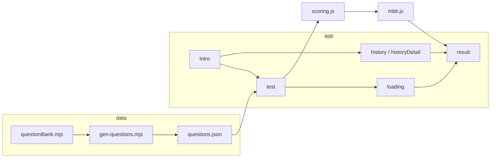

# MBTI / Cognitive Functions Assessment (Myanmar)

A client-only web app: **100 Likert-scale questions** in Myanmar, **cognitive function** scoring, **MBTI-style** type resolution, **results** with charts and copy, **local progress** and **result history**, plus **PNG export** (html2canvas).

Stack: **React 19**, **Vite**, **Tailwind CSS**.

---

## Project workflow (end-to-end)

### 1. Question data pipeline

1. **Author / curate** items in `scripts/questionBank.mjs` (`QUESTION_BANK`). Each entry maps to a cognitive function (`Ne`, `Ni`, …), optional **reverse** scoring, and optional **weight**.
2. Run **`npm run generate-questions`** (`scripts/gen-questions.mjs`). This validates exactly **100** items and writes `src/data/questions.json` (fields: `id`, `question`, `function`, `reverse`, `weight`).
3. The app **imports** `questions.json` at build time; change the bank → regenerate JSON → rebuild or refresh dev server.

### 2. Runtime app flow (user journey)

State lives in **`TestContext`** (`src/context/TestContext.jsx`). The UI **phase** drives which screen mounts:

| Phase | Screen | What happens |
|--------|--------|----------------|
| `intro` | `IntroScreen` | Explains the test; **Start** or **Continue** if saved progress exists; link to **history**. |
| `test` | `TestScreen` | **5 questions per page**; must answer all on a page before **Next**; **Back** and optional **restart from beginning** (modal). |
| `loading` | `LoadingScreen` | Short delay while the result is computed after **View result**. |
| `result` | `ResultScreen` | Live result: hero, function chart, narrative, actions (restart, PNG, share, history). |
| `history` | `HistoryList` | Lists past results from storage. |
| `historyDetail` | `ResultScreen` | Same result UI, fed from a **hydrated** history entry (read-only context). |

Routing is a simple `switch` on `phase` in `src/App.jsx`.

### 3. Persistence (browser)

- **In-progress test** — `localStorage` key **`mbti-cf-cognitive-test-v3`**: `version`, `answers`, `currentPage`, `savedAt`. Restored on load so users can resume.
- **Result history** — **`mbti-cf-result-history-v1`** via `src/utils/storage.js` (capped list, e.g. 40 entries). Finishing a test **appends** a serialized snapshot; history list opens entries into `historyDetail`.

### 4. Scoring and result resolution

1. **`src/utils/scoring.js`** — Maps Likert **1–5** per question, applies **reverse** items (`6 − answer` when `reverse: true`), applies **weights**, sums into **eight function scores**, and derives display **percentages** for charts.
2. **`src/utils/analysis.js`** — Axis / consistency / confidence style logic used by the resolver.
3. **`src/utils/mbti.js`** — **`resolveTestResult`**: combines profiles (`src/data/mbtiProfiles.js`), stacks, and matching to produce **primary/secondary types**, narrative fields, **inconsistency** warnings, etc.
4. **`src/data/typeContent.js`** — Type-specific copy (summary, strengths, growth, …) keyed by type.
5. **`ResultExportPanel`** — Off-DOM layout used only for **PNG** capture (`src/utils/pngExport.js` + html2canvas).

---

## Scripts

| Command | Purpose |
|---------|---------|
| `npm run dev` | Vite dev server |
| `npm run build` | Production build to `dist/` |
| `npm run preview` | Preview production build |
| `npm run lint` | ESLint |
| `npm run generate-questions` | Regenerate `src/data/questions.json` from the bank |

---

## Source layout (short)

- `src/context/TestContext.jsx` — Phases, answers, pages, finish/restart, history wiring.
- `src/components/` — UI: `IntroScreen`, `TestScreen`, `QuestionCard`, `ProgressBar`, `ResultScreen`, `HistoryList`, modals, charts, export panel.
- `src/utils/` — `scoring`, `analysis`, `mbti`, `storage`, `historyResult`, `pngExport`.
- `src/data/` — `questions.json`, `mbtiProfiles.js`, `typeContent.js`.
- `scripts/` — Question bank + generator.
- `public/favicon.svg` — App icon.

---

## Disclaimer

On-screen copy states that results are **educational / rough guidance**, not medical or clinical advice.
